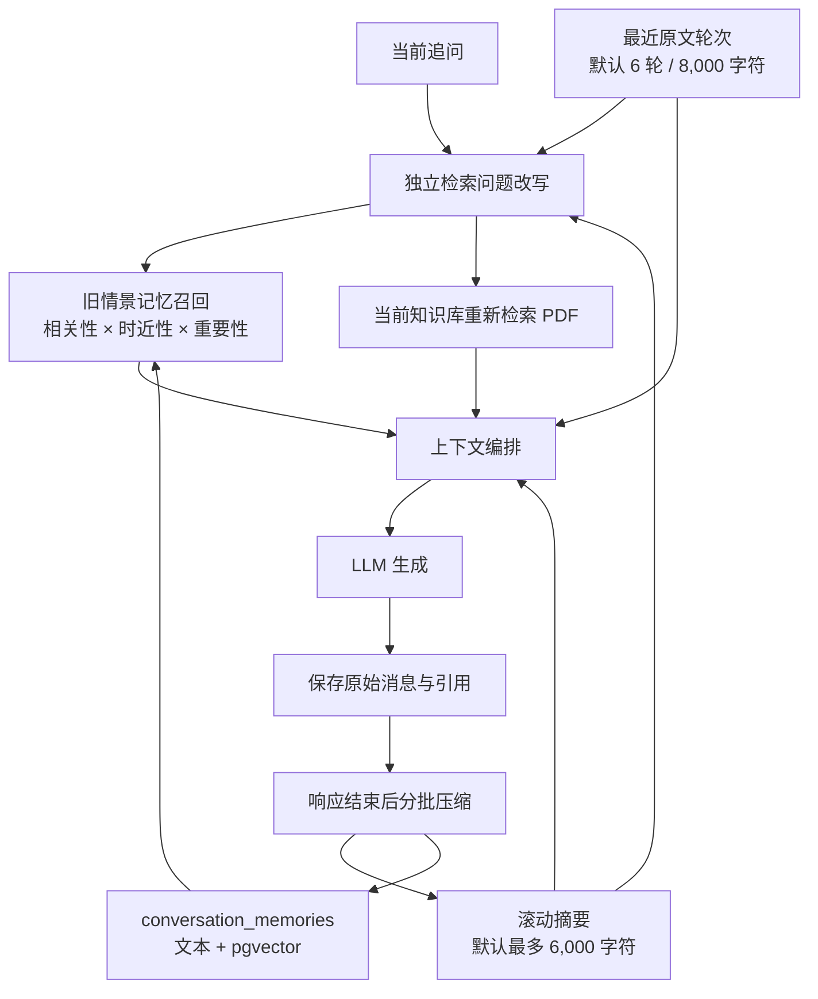

# PaperPilot 长上下文与记忆架构

> 版本：2026-07-31-memory-v1
> 数据库迁移：`0008_conversation_memory`

## 设计依据

本实现没有把全部聊天记录直接塞进模型，而是采用分层上下文：

- LangGraph 将线程内消息视为短期记忆，并建议长对话使用裁剪、滚动摘要与可语义检索的
  长期存储：[Memory overview](https://docs.langchain.com/oss/python/concepts/memory)、
  [Add and manage memory](https://docs.langchain.com/oss/python/langgraph/add-memory)；
- Anthropic 将上下文视为有限资源，建议持续筛选工作记忆并把结构化笔记持久化到窗口之外：
  [Effective context engineering for AI agents](https://www.anthropic.com/engineering/effective-context-engineering-for-ai-agents)；
- MemGPT 用类似操作系统的分层存储管理有限上下文：
  [MemGPT: Towards LLMs as Operating Systems](https://arxiv.org/abs/2310.08560)；
- Generative Agents 使用完整经历、较高层反思，以及结合相关性、时近性和重要性的动态召回：
  [Generative Agents](https://arxiv.org/abs/2304.03442)。

PaperPilot 的适配重点是：**会话记忆帮助理解问题，但论文原文仍是回答事实的唯一证据**。

## 分层结构



### 1. 原始事件流

`messages` 保存完整用户/助手消息、引用和运行元数据。新增 `sequence` 是会话内单调序号，
避免 PostgreSQL 同一事务中 `created_at` 相同导致用户消息与助手消息顺序不确定。

原始消息不会因为摘要而删除。前端默认加载最近 200 条，较早消息仍保留在数据库。

### 2. 工作记忆

默认保留最近 6 轮原始对话，并受 `RAG_HISTORY_MAX_CHARS=8000` 限制。裁剪以完整
`user + assistant` 轮次为单位，避免只留下孤立助手回答。

### 3. 滚动摘要

消息达到 `MEMORY_SUMMARY_TRIGGER_MESSAGES=20` 后，在流式响应完成后将较早消息按
`MEMORY_SUMMARY_BATCH_MESSAGES=8` 分批合并进摘要。更新采用两阶段方式：

1. 无锁读取当前摘要和待压缩消息；
2. 调用模型或抽取式降级摘要；
3. 重新锁定会话，校验 revision 后原子提交。

模型调用期间不会长时间持有数据库行锁。进程退出只会延迟压缩；下一轮会重新发现未压缩
消息，不会丢失原始聊天。

### 4. 可检索情景记忆

每个压缩批次生成一条 `conversation_memories`：

- 严格按 `owner_id + conversation_id` 隔离；
- 记录来源消息序号范围、重要性、模型和 embedding 版本；
- PostgreSQL 使用 1024 维 pgvector HNSW 召回；
- 同时提供 pg_trgm 候选路径和纯文本相关度降级；
- 默认召回 Top 4，最多注入 4,000 字符。

召回分数以语义/词法相关性为门控，再结合时近性和重要性；无相关性时不会仅因“最近”
而注入无关旧记忆。

### 5. 独立检索问题改写

每轮追问会先根据摘要和最近轮次解析指代，例如：

```text
此前：请介绍 AlphaNet 方法。
当前：它用了什么数据集？
检索：AlphaNet 用了什么数据集？
```

服务端要求模型只能替换指代，必须保留当前问题的谓词、对象与限定词。输出还要通过
“问题意图保真”校验；若模型返回非 JSON、丢失“数据集/局限/实验设置”等核心语义，
自动回退为“前文主题 + 当前原问题”，不阻断问答。

PDF 混合检索使用改写后的独立问题；最终生成仍显示并回答用户原问题。

## 证据与安全边界

- 对话历史、摘要和情景记忆都是不可信数据，只能解析指代、任务状态和输出偏好；
- 论文事实、数值、实验设置和结论必须在本轮重新检索的 PDF Context/工具证据中出现；
- 记忆中的 Prompt Injection 不得改变角色、泄露系统提示或触发工具；
- 所有记忆查询都带 `owner_id + conversation_id`，不会跨账号或跨会话召回；
- 当前不默认建立跨会话用户画像，避免不同研究课题间隐式串扰。

## 用户控制

- 工作台显示“长记忆：开/关”及摘要、revision、情景记忆数量；
- 关闭时删除派生摘要和 `conversation_memories`，但保留原始聊天消息；
- 用户可重新开启，后续轮次会从仍存在的原始消息逐步重建；
- 删除整个会话会通过外键级联删除消息与全部派生记忆。

API：

```http
PATCH  /api/conversations/{id}        {"memory_enabled": true}
DELETE /api/conversations/{id}/memory
GET    /api/conversations/{id}?message_limit=200
```

## 配置与可观测性

核心变量见 `.env.example`，生产建议先使用默认值。`/api/health` 新增：

- `conversation_memory_enabled`
- `memory_enabled_conversations`
- `memory_episodes`
- `memory_compaction_pending`
- `memory_last_updated_at`

助手消息的 `meta.memory` 记录本轮是否改写查询、是否使用摘要、召回数量和实际独立检索问题。

## 验收

```bash
cd backend
python -m pytest -q
python -m evals.run_memory_eval
```

回归覆盖：

- 指代改写与非 JSON 降级；
- 改写意图保真；
- 60 条消息压缩后“摘要 + 最近窗口”无缺口；
- 完整问答对裁剪；
- owner/conversation 隔离；
- 清除与关闭记忆；
- SQLite、PostgreSQL 迁移与 1024 维记忆向量；
- HNSW 实际查询计划。
