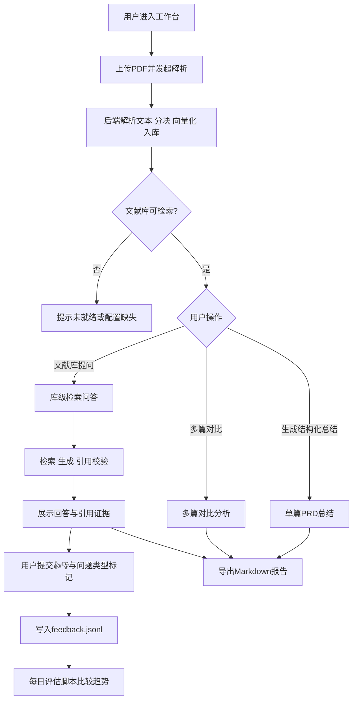

# PaperPilot 项目 PRD（V1.0）

## 1. 产品概述

### 1.1 产品名称
PaperPilot - AI 文献阅读与对比助手

### 1.2 产品定位
帮助用户快速完成“读论文-提炼结论-跨文献对比-持续追问-输出报告”的闭环，提高科研阅读与决策效率。

### 1.3 目标用户
- 研究生/博士生：需要高频读论文、写综述、准备组会
- 算法工程师/研究员：需要快速判断论文价值与复现可行性
- AI 学习者：需要结构化理解论文内容

### 1.4 核心价值
- 将“论文阅读”从线性手工流程升级为结构化工作流
- 给出可追溯证据（chunk 引用）而非纯总结
- 支持文献库级问答与多篇对比，提升横向分析能力

## 2. 业务目标与成功指标

### 2.1 业务目标
- 提升用户从上传文献到得到可用结论的速度
- 提高回答可信度（有证据、可定位）
- 形成可持续优化的数据闭环（反馈->评估->改进）

### 2.2 成功指标（建议）
- TTFV（首个有效结果时间）< 60s（PDF 中等大小）
- 问答有引用占比 > 80%
- 用户正反馈率（👍）逐周提升
- “问题类型错误”反馈占比逐周下降
- 每日评估分数（eval）稳定或上升

## 3. 用户场景与流程

### 3.1 关键场景
1. 单篇速读：上传论文 -> 生成结构化总结 -> 追问关键问题
2. 跨篇对比：多篇加入对比列表 -> 生成差异/机会/建议
3. 持续研读：围绕文献库反复提问 -> 反馈质量 -> 导出报告

### 3.2 核心用户流程
1. 上传 PDF，解析并建立索引
2. 查看自动回填标题/摘要
3. 生成 PRD 结构化总结（研究问题/方法/结论/关键词）
4. 在文献库级对话中提问，多轮追问
5. 对回答进行 👍/👎 与“问题类型错误”标记
6. 选择多篇文献进行对比
7. 导出 Markdown 结果用于组会/复盘

### 3.3 端到端流程图

## 4. 功能需求

### 4.1 文档入库与索引
- 支持 PDF 上传、文本抽取与分块（chunk）
- 生成向量索引，支持后续检索
- 展示入库状态、分块数量、是否可问答

**验收标准**
- 上传成功后返回 `document_id`
- 可见文档状态（ready/failed/ready_no_embed）
- 失败场景有明确错误提示

### 4.2 结构化总结（单篇）
- 输出字段：
  - `researchQuestion`
  - `methods`
  - `conclusions`
  - `keywords[]`
- 支持缓存命中标记

**验收标准**
- 返回 JSON 结构稳定
- 文本为空/不可解析时给出可理解错误信息

### 4.3 文献库级问答（RAG）
- 基于向量检索 + 关键词/规则召回融合
- 多轮历史支持
- 输出 `answer + citations + confidence + out_of_scope`
- 引用需可溯源（chunk_id/ref_id）

**验收标准**
- 当检索为空时进入降级回答
- citation 与上下文一致，错误引用被过滤或修复

### 4.4 多篇论文对比
- 至少 2 篇文献参与
- 输出：
  - `commonTheme`
  - `differences[]`
  - `opportunities[]`
  - `recommendations[]`

**验收标准**
- 结构字段齐全
- UI 可清晰展示对比内容

### 4.5 反馈与评估闭环
- 对每条回答可提交：`up/down` + `wrong_question_type`
- 持久化至 `feedback.jsonl`
- 每日评估脚本比较 today/yesterday

**验收标准**
- 反馈写入成功率高
- `npm run eval` 可在有数据时产出趋势结论

### 4.6 导出能力
- 支持导出 Markdown（总结+对比）

## 5. 非功能需求

### 5.1 性能
- 常规问答响应可接受（目标 3-8s，视模型与文本规模）
- 首次向量化可较慢，但需有状态反馈

### 5.2 可用性
- 关键路径可视化（状态条、按钮可用态、错误提示）
- 降级路径有引导（改写建议）

### 5.3 安全
- API Key 仅后端使用，不进入浏览器
- 敏感配置通过 `.env` 管理，不入库

### 5.4 可维护性
- 保持 API 契约稳定
- 关键流程模块化（检索、生成、校验、持久化）

## 6. 系统与接口（摘要）

### 6.1 核心接口
- `POST /api/documents`
- `POST /api/documents/:id/summarize`
- `POST /api/library/query`
- `POST /api/compare`
- `POST /api/feedback`
- `GET /api/library/status`
- `POST /api/library/reset`

### 6.2 数据存储
- `data/library-store.json`（文献库/会话持久化）
- `data/feedback.jsonl`（反馈日志）
- `data/langgraph-checkpoints.json`（可选，图状态持久化）

## 7. 风险与应对

- PDF 不可提取文本：提示扫描版/图片版，建议 OCR
- 上游模型波动：保留降级与缓存策略
- 引用不一致：增加校验与 excerpt 修复
- 网络/代理问题：提供代理配置指引（如 7890）

## 8. 版本规划（建议）

### V1（已实现主干）
- 上传解析、结构化总结、库级问答、多篇对比、反馈闭环、导出

### V1.1（短期）
- 会话 thread_id 完整贯通
- 查询 embedding 缓存
- 更细粒度性能指标与日志

### V1.2（中期）
- 引入 reranker / compression retriever
- 用户体系与协作空间
- 文献来源自动拉取（如 arXiv）

